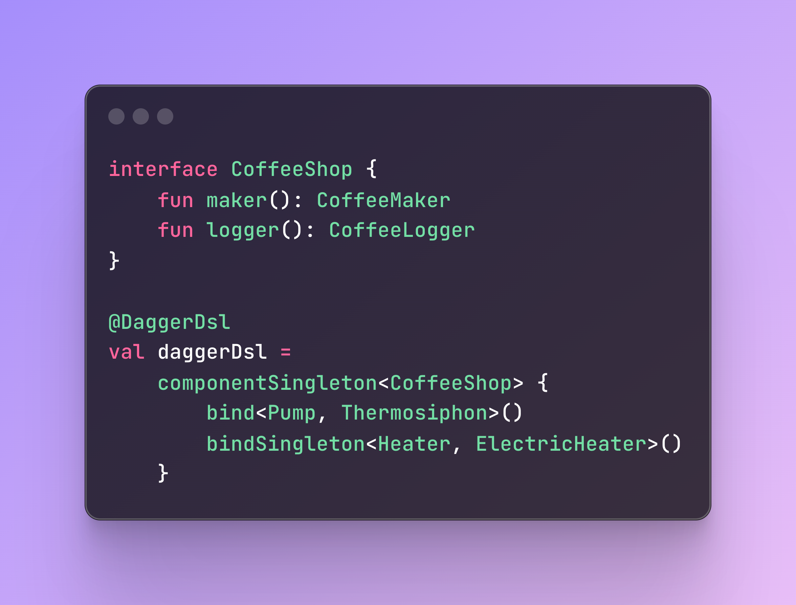

[](https://github.com/AntonButov/dagger-dsl/blob/trunk/LICENSE)


[](https://github.com/AntonButov/dagger-dsl)


# Dagger DSL

KSP processor that generates Dagger structured files.



📚 [Documentation](https://antonbutov.github.io/dagger-dsl/)   [Sample](https://github.com/AntonButov/gradle-dsl-sample)
```kotlin
repositories {
    mavenCentral()
}
```
```kotlin
plugins {
    id("com.google.devtools.ksp") version "2.1.20-2.0.1"
    id ("kotlin-kapt") version "2.1.20"
}
```
```kotlin
dependencies {
    ksp("io.github.antonbutov:dagger-dsl-processor:1.2.0-alpha")
    implementation("io.github.antonbutov:dagger-dsl-core:1.2.0-alpha")
    implementation("com.google.dagger:dagger:2.x")
    kapt("com.google.dagger:dagger-compiler:2.x")
}
```


## 🤝 Contributing
Thanks for checking out Dagger DSL! Contributions of all kinds are welcome — whether it’s code, ideas, docs, or just feedback.

Quick start:
- Fork & clone the repo

- Create a branch: git checkout -b feature/your-feature

- Make your changes

- Run ./gradlew build to test

- Open a Pull Request — I’ll review it asap (with a little help from CodeRabbit 🐰)

Feel free to open an Issue if you’re not sure where to start.
